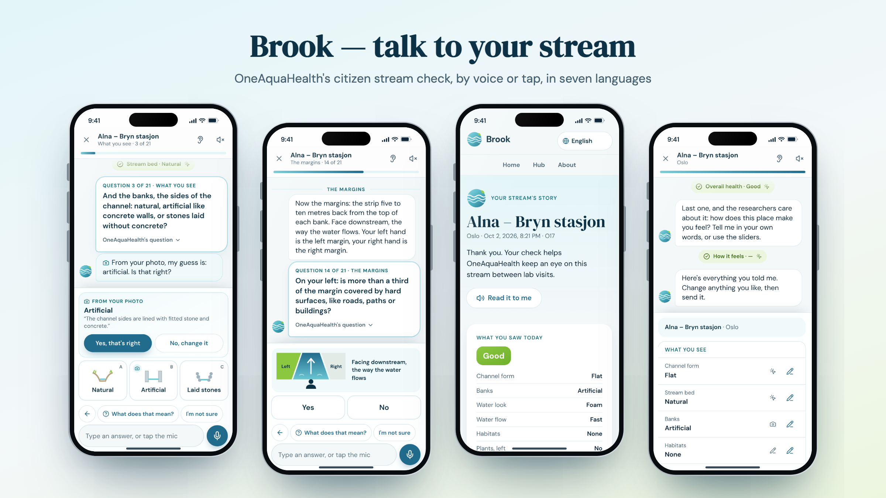

# Brook — talk to your stream

**In one minute:** OneAquaHealth is a European science project that studies the health of small rivers (streams) in five cities. It asks ordinary people to visit a stream and answer about twenty questions: Is the water clear or muddy? Are the sides natural or concrete? Are pipes pouring dirty water in? But many of the questions use hard words, so people get confused or give up.

**Brook is a friendly guide on your phone** that turns those questions into a simple conversation. You talk or tap, in seven languages. Brook explains any word, looks at your photos and suggests answers you confirm, gently asks you to look again if two answers don't fit, and at the end shows what scientists found at that stream. Your answers go to OneAquaHealth in the exact form they already use.

Built for the **OneAquaHealth IEEE Global Hackathon 2026** · *Healthy Waters, Healthy Ecosystems, Healthy Communities*.



| | |
|---|---|
| **Live app** | https://brook-oah.vercel.app |
| **Try it without a stream** | https://brook-oah.vercel.app/check?demo=1 (real photos of OneAquaHealth site O17, Alna at Bryn, Oslo) |
| **Research hub** | https://brook-oah.vercel.app/hub |
| **How it works** | https://brook-oah.vercel.app/about |
| **Demo video** | *(link added at submission)* |

## Track alignment

| | |
|---|---|
| **Primary: Track 1 — Citizen Science UX** | The brief: *“complex tools, confusing terminology, and low participation”* → *“guided workflows, simplified ecological terms, improved data accuracy, and repeat engagement.”* Brook is exactly that: a guided conversation, plain-language explanations of every term, photo suggestions and second looks for accuracy, and a personal story of your stream to bring you back. |
| Track 3 — AI-Supported Assessment | AI suggests, people decide. Strict-schema answers limited to OneAquaHealth's codes, human confirmation of every suggestion, measured agreement, and a full no-AI fallback. |
| Track 4 — Awareness & Storytelling | “Your stream's story”: your observation next to OneAquaHealth's lab results for that exact site, with One Health tips for people, pets and the stream. |
| Track 7 — Digital Health Standards | Each check becomes an HL7 FHIR R4 transaction shaped by the OneAquaHealth Implementation Guide, with AI transparency built into the data (answer-source extension, Provenance, HL7 `AIAST` label). |

## The problem

OneAquaHealth's citizen stream check asks a volunteer standing at an urban stream to judge “transversal artificial barriers”, whether “impervious areas cover more than one third of the left margin” (left facing *downstream* — almost nobody knows), and the “dominant vegetation” of the riparian zone. Unsure people guess or give up; researchers receive data they can't fully trust. OneAquaHealth's own FAIR assessment scored its data about 1.6/3, with interoperability the weakest — and the project ends in December 2026, so what keeps citizens watching these streams must be cheap to run and easy to adopt.

## What Brook does

1. **A conversation, not a form.** Brook asks each of OneAquaHealth's questions in plain words, by voice or text, in English, Portuguese, French, Italian, Dutch, Norwegian or Greek. “What does that mean?” always works; the official wording is one tap away; pictograms carry the meaning before the words do.
2. **Photos suggest, people decide.** From upstream, downstream and surroundings photos, Brook suggests answers to the questions a photo can answer — with what it saw. Nothing is recorded until the person confirms or corrects it.
3. **A second look.** Seven published rules notice contradictions — a “good” rating next to a sewage discharge, clear water after 20 mm of rain — and ask gently. They never change an answer; the decision is kept with the record.
4. **Your stream's story.** After sending: what OneAquaHealth scientists measured at that site (macroinvertebrates, diatoms, fish, health-risk scores) next to what you saw, the last three days of weather, and precautionary One Health tips.
5. **Data that travels.** The exact `CitizenSubmissionPutDTO` OneAquaHealth's API accepts, plus a FHIR bundle posted to OneAquaHealth's HL7 Europe sandbox.
6. **A research hub.** Every check on a map of the 106 research sites, **which questions confuse volunteers** (help requests, “not sure”, not understood — something a paper form can never tell you), how often people accept the AI's suggestions, and how streams make people feel.

## How it works

```
Phone (PWA, offline-capable)                     Server (Vercel functions)            Data
┌───────────────────────────────┐   free text    ┌──────────────────────────┐
│ Dialogue engine (OAH protocol)│ ─────────────▶ │ /api/interpret  ┐        │
│ Local matcher (7 languages)   │   photos       │ /api/vision     ├ OpenAI │ ◀─ spending caps,
│ Second-look rules + weather   │ ─────────────▶ │                 ┘        │    strict schemas
│ Offline queue (IndexedDB)     │   check        │ /api/submissions ───────────▶ Supabase (EU) — RLS + server secret
└───────────────────────────────┘ ─────────────▶ │                  ───────────▶ OAH FHIR sandbox (HL7 Europe)
        ▲                                         └──────────────────────────┘
        └── OAH sites, lab classes, health risks (api.enora-oah.eu snapshot) · weather (Open-Meteo)
```

- **Protocol:** `src/core/protocol.ts` — every field and answer code comes from OneAquaHealth's Citizen Science App API (`api.enora-oah.eu/api/citizens/*`) and its submission schema. Unit tests check our codes against their published lists.
- **Understanding replies:** `src/core/matcher.ts` understands most replies on the phone with word lists; only what it can't is sent to `/api/interpret`, where the model may only choose the current question's codes (strict JSON schema) and the server validates again.
- **Photo suggestions:** `api/vision.ts` returns suggestions with confidence and evidence; low-confidence ones are never shown.
- **FHIR:** `src/core/fhir.ts` — see [docs/FHIR.md](docs/FHIR.md).
- **Stack:** React 19, TypeScript, Vite 8, Tailwind 4, MapLibre (OpenFreeMap), Recharts, Dexie, Supabase (Postgres, Frankfurt), Vercel, OpenAI `gpt-6-luna`, Web Speech API.

## Responsible AI

- **AI never decides.** Every answer is given or confirmed by a person. The overall health rating is always the citizen's own; the AI is never asked for it.
- **AI can only choose valid answers** — strict JSON schema restricted to the question's OneAquaHealth codes, validated again on the server; replies are treated as data, never instructions.
- **Works without AI.** The dialogue is scripted; if the AI is unavailable or its budget is spent, the check continues by voice and tap.
- **Every answer says where it came from:** tapped, said, typed, understood with AI, photo suggestion confirmed, or corrected — stored with the check, exported in FHIR, and measured in the hub.
- **Cost-capped:** all-time, daily and per-caller limits, failing closed (`api/_lib/ai.ts`). Measured cost: about **0.1 cent per check** (one photo analysis ≈ 0.10 ¢, each AI-understood reply ≈ 0.006 ¢).

## Adoption & cost

1. **Embed it** — Brook's CSP already allows framing by OneAquaHealth's app domains, so the Citizen Science App can open it as a “talk me through it” mode.
2. **Send straight to OneAquaHealth** — every check is already the exact `CitizenSubmissionPutDTO`; with a service account it is one POST to `/api/citizens/submit`.
3. **Let local volunteers check the words** — one file per language.

At pilot scale hosting is **€0** (static app, serverless functions, free database tier); the optional AI costs **≈0.1 cent per check** (measured), so **≈€15 for 10,000 checks a year** across five cities — and zero with AI switched off. MIT-licensed, no accounts, no app store.

## Privacy & security

- Photos are shrunk and re-encoded on the phone (every EXIF field, including GPS, removed) and shared only with consent.
- No accounts. A random device id is hashed before it leaves the phone; IP addresses are never stored (rate limits use a salted daily hash).
- Database in the EU (Supabase, Frankfurt). Every table has row-level security with no public policies; the only way in is a set of `SECURITY DEFINER` functions that check a server-only secret. No secret ever reaches the browser or the repository.
- Same-origin checks, request size limits, server-side validation of every field, a strict Content-Security-Policy.

## Evidence

| What we checked | How | Result |
|---|---|---|
| Brook understands real replies without AI | 238 replies in 7 languages written by someone who never saw Brook's word lists (`tests/eval/`) | **93%** understood correctly on first sight, 4% deferred to AI/tap, 3% wrong. After fixing three general problems it revealed: 96% / 4% / **0% wrong** (same set, no longer held out) |
| Photo suggestions are right | 36 real photos from Wikimedia Commons of streams in and around Oslo, Toulouse and Ghent, none used while building Brook; we labelled only what each photo plainly shows (`tests/eval/photos.json`, `npm run eval:vision`) | Suggested 134 of 138 labelled answers; **132 right (99%)**, every high-confidence one right (73/73). Both misses: which plants dominate one bank where grass, shrubs and trees mix. 3 of 3 non-stream images (maps, a plant) recognised, **0 suggestions** on them. Not scored: 260 suggestions on things we didn't label, such as channel shape |
| Health-data format | Official HL7 validator against the OneAquaHealth FHIR IG ([docs/FHIR.md](docs/FHIR.md)) | **0 errors, 0 warnings**; verified checks also pass the IG's indicator profile; 4 deliberately broken bundles rejected |
| Works with OneAquaHealth's server | Round trip to the OAH FHIR sandbox | 14 resources created; re-sending updates, never duplicates |
| Same answer codes as OneAquaHealth | Unit tests against their published answer lists | pass |
| Accessibility | axe-core, WCAG 2.1 AA, phone screen | **0 violations** on every screen |
| No signal at the stream | Network cut mid-check (`scripts/offline-test.mjs`) | check kept, sent on reconnect |
| Whole flow | Robot walkthrough on a phone screen (`scripts/e2e-walkthrough.mjs`) | 24 questions by tap, typing, “not sure” and help; 0 errors |
| Everything else | `npm test` | 111 tests pass |
| AI cost | Spending ledger | ≈0.1 ¢ per check |

## Honest limits

- The research hub starts with **simulated checks** (`scripts/seed-demo.mjs`), clearly marked, so it has something to show. Their question-difficulty figures are stated assumptions, not findings. Checks made with the sample photos are marked **Trial**; only checks with people's own photos count as **Field**.
- Translations were prepared for this prototype and have not yet been reviewed by native-speaking volunteers.
- Voice depends on the browser's speech engine: none in Firefox (tap and typing still work); in Chrome, recognition runs on Google's servers.
- Photo suggestions can be wrong — that is why they are suggestions and why agreement is measured. The photo test scores only what a photo plainly shows; suggestions on harder things (channel shape, banks that differ) are not yet measured.
- One Health tips are precautionary, based on simple published rules and OneAquaHealth's own risk scores. Not medical advice.
- OneAquaHealth's FHIR sandbox is shared and wiped regularly; Brook keeps its own record of every submission result.

## Run it

```bash
npm install
cp .env.example .env.local   # fill in Supabase + (optional) OpenAI
npm run dev                  # app + API on http://localhost:5173
npm test                     # unit tests
npm run data                 # refresh the OneAquaHealth data snapshot
```

## Credits

Data from the OneAquaHealth project (Horizon Europe grant 101086521) via its public API, the OneAquaHealth field protocols (Zenodo, CC BY 4.0) and the OneAquaHealth FHIR IG by HL7 Europe. Weather by Open-Meteo. Sample photos from Wikimedia Commons (CC BY-SA). Full list in [docs/CREDITS.md](docs/CREDITS.md).

Brook is a community prototype for the hackathon and **not an official OneAquaHealth product**. Code: MIT licence.
